# Jenkins CI/CD Pipeline with Blue-Green Deployment

## 프로젝트 개요

| 항목 | 내용 |
|------|------|
| 프로젝트명 | Jenkins 기반 CI/CD 파이프라인 + Blue-Green 무중단 배포 |
| 기간 | 2026.01 |
| 역할 | DevOps 엔지니어 (1인) |
| GitHub | https://github.com/ParkHyeonBeom/ci-cd-study |

---

## 기술 스택

| 분류 | 기술 |
|------|------|
| CI/CD | Jenkins (Master-Worker 구조) |
| 컨테이너 | Docker, Docker Compose |
| 클라우드 | AWS EC2 (Ubuntu 24.04) |
| 레지스트리 | Docker Hub |
| 빌드 | Gradle 8.8, Spring Boot 3.3.2, Java 21 |
| 프론트엔드 | React, Vite, TailwindCSS |
| 버전관리 | Git, GitHub |
| 코드품질 | SonarQube |
| 리버스 프록시 | Nginx (트래픽 전환) |

---

## 시스템 아키텍처

```
┌─────────────────────────────────────────────────────────────────────────────────┐
│                         CI/CD Pipeline with Blue-Green Deployment               │
└─────────────────────────────────────────────────────────────────────────────────┘

  ┌──────────┐         Webhook (ngrok)         ┌────────────────────────────────┐
  │  GitHub  │ ───────────────────────────────▶│       Jenkins Master           │
  │   Repo   │                                 │   (ci-cd-study-jenkins-1)      │
  └──────────┘                                 └───────────────┬────────────────┘
                                                               │
                                                               │ SSH (Port 22)
                                                               ▼
                                               ┌────────────────────────────────┐
                                               │       Jenkins Worker           │
                                               │   (ci-cd-study-worker-1-1)     │
                                               │   - Docker CLI 설치            │
                                               │   - EC2 배포 전담              │
                                               └───────────────┬────────────────┘
                                                               │
                                                               │ SSH + SCP
                                                               ▼
  ┌──────────┐       docker pull              ┌─────────────────────────────────┐
  │  Docker  │◀───────────────────────────────│           AWS EC2               │
  │   Hub    │                                │    (ap-northeast-2)             │
  │          │                                │                                 │
  │ beomiya/ │                                │  ┌───────────────────────────┐  │
  │cicd-study│                                │  │      Nginx (Gateway)      │  │
  └──────────┘                                │  │        Port: 80           │  │
                                              │  └─────────────┬─────────────┘  │
                                              │                │                │
                                              │       ┌────────┴────────┐       │
                                              │       ▼                 ▼       │
                                              │  ┌─────────┐       ┌─────────┐  │
                                              │  │app-blue │       │app-green│  │
                                              │  │ :8081   │       │ :8082   │  │
                                              │  └─────────┘       └─────────┘  │
                                              └─────────────────────────────────┘
```

---

## Blue-Green 무중단 배포 파이프라인

```mermaid
flowchart LR
    A[GitHub Push] --> B[Checkout]
    B --> C[Build & Test]
    C --> D[Docker Build & Push]
    D --> E[Detect Active Env]
    E --> F[Sync Config Files]
    F --> G[Deploy to Standby]
    G --> H[Health Check]
    H --> I[Switch Traffic]
    I --> J[Stop Old Env]
    J --> K[Cleanup Images]
```



### 파이프라인 단계별 설명

| Stage | 설명 | 실행 위치 |
|-------|------|----------|
| Checkout | GitHub에서 소스 코드 체크아웃 | worker-1 |
| Build & Test | Gradle 빌드 및 테스트 실행 | worker-1 |
| Docker Build & Push | Docker 이미지 빌드 후 Hub에 Push | worker-1 |
| Detect Active Env | 현재 활성 환경(Blue/Green) 감지 | worker-1 → EC2 |
| Sync Config Files | 설정 파일들을 EC2로 복사 | worker-1 → EC2 |
| Deploy to Standby | 대기 환경에 새 버전 배포 | EC2 |
| Health Check | 새 버전 헬스체크 (최대 10회) | EC2 |
| Switch Traffic | Nginx 설정 변경으로 트래픽 전환 | EC2 |
| Stop Old Env | 이전 환경 컨테이너 중지 | EC2 |
| Cleanup Images | 오래된 Docker 이미지 정리 | EC2 |

---

## 핵심 구현 내용

### 1. Jenkins Master-Worker 분산 구조

```yaml
# docker-compose.yml
services:
  jenkins:
    image: jenkins/jenkins:latest
    user: root
    ports:
      - "8081:8080"
      - "50000:50000"
    volumes:
      - ${HOST_JENKINS_HOME}:/var/jenkins_home
      - /var/run/docker.sock:/var/run/docker.sock

  worker-1:
    build:
      context: .
      dockerfile: Dockerfile.jenkins-agent
    volumes:
      - ${HOST_JENKINS_WORKER_1}:/home/jenkins
      - /var/run/docker.sock:/var/run/docker.sock
    environment:
      - JENKINS_SLAVE_SSH_PUBKEY=<공개키>
```

### 2. Jenkins Agent Docker 설정

```dockerfile
# Dockerfile.jenkins-agent
FROM jenkins/ssh-agent:latest-jdk21

USER root

# Docker CLI 설치
RUN apt-get update && \
    apt-get install -y apt-transport-https ca-certificates curl gnupg && \
    install -m 0755 -d /etc/apt/keyrings && \
    curl -fsSL https://download.docker.com/linux/debian/gpg -o /etc/apt/keyrings/docker.asc && \
    chmod a+r /etc/apt/keyrings/docker.asc && \
    echo "deb [arch=$(dpkg --print-architecture) signed-by=/etc/apt/keyrings/docker.asc] https://download.docker.com/linux/debian bookworm stable" > /etc/apt/sources.list.d/docker.list && \
    apt-get update && \
    apt-get install -y docker-ce-cli && \
    rm -rf /var/lib/apt/lists/*

# jenkins 유저에게 docker 소켓 접근 권한 부여
RUN usermod -aG root jenkins
```

### 3. Blue-Green 배포 구성

```yaml
# docker-compose-app.yml (EC2)
services:
  app-blue:
    hostname: app-blue
    container_name: app-blue
    image: ${IMAGE:-beomiya/cicd-study:latest}
    ports:
      - "8081:8080"
    networks:
      vpc:
        ipv4_address: 192.168.0.3

  app-green:
    hostname: app-green
    container_name: app-green
    image: ${IMAGE:-beomiya/cicd-study:latest}
    ports:
      - "8082:8080"
    networks:
      vpc:
        ipv4_address: 192.168.0.4

  api-gateway:
    image: nginx
    ports:
      - "80:80"
    volumes:
      - ./nginx.conf:/etc/nginx/nginx.conf
      - ./nginx-conf:/etc/nginx/conf.d
```

### 4. Nginx 트래픽 전환 설정

```
nginx-conf/
├── fastcampus-cicd.conf    # 현재 활성 설정 (심볼릭 링크 역할)
├── blue-shutdown.conf       # Green만 활성 (Blue 종료 시)
├── green-shutdown.conf      # Blue만 활성 (Green 종료 시)
└── all-up.conf              # 둘 다 활성 (부하 분산)
```

---

## 프로젝트 구조

```
ci-cd-study/
├── src/
│   └── main/
│       ├── java/com/fastcampus/cicdstudy/
│       │   ├── CicdStudyApplication.java
│       │   └── controller/HealthController.java
│       └── resources/
│           ├── application.yml
│           ├── application-blue.yml
│           └── application-green.yml
├── portfolio-park/              # React 프론트엔드
├── docs/
│   └── zero-downtime-deployment/
│       ├── README.md
│       ├── 01-concepts.md
│       ├── 02-deployment-strategies.md
│       ├── 03-blue-green-deep-dive.md
│       ├── 04-implementation-guide.md
│       ├── 05-ec2-setup-guide.md
│       ├── 06-troubleshooting.md      # 트러블슈팅 가이드
│       └── 07-jenkins-setup.md        # Jenkins 환경 구축 가이드
├── nginx-conf/                  # Nginx 트래픽 전환 설정
├── Dockerfile                   # Multi-stage 빌드
├── Dockerfile.jenkins-agent     # Jenkins Worker 이미지
├── Jenkinsfile                  # Blue-Green 배포 파이프라인
├── docker-compose.yml           # Jenkins 로컬 환경
└── docker-compose-app.yml       # EC2 Blue-Green 배포
```

---

## 빠른 시작

### 1. 로컬 Jenkins 환경 실행

```bash
# 환경 변수 설정
export HOST_JENKINS_HOME=/path/to/jenkins_home
export HOST_JENKINS_WORKER_1=/path/to/worker_home

# Jenkins 실행
docker-compose up -d

# Jenkins 접속
open http://localhost:8081
```

### 2. Jenkins 초기 설정

```bash
# 초기 비밀번호 확인
docker exec ci-cd-study-jenkins-1 cat /var/jenkins_home/secrets/initialAdminPassword

# SSH known_hosts 등록
docker exec ci-cd-study-jenkins-1 bash -c \
  "ssh-keyscan -H worker-1 >> /var/jenkins_home/.ssh/known_hosts"
```

### 3. 필수 Jenkins Credentials

| ID | Type | 용도 |
|----|------|------|
| `dockerhub-credentials` | Username/Password | Docker Hub 로그인 |
| `ec2-ssh-key` | SSH Private Key | EC2 SSH 접속 |
| `github-token` | Username/Password | GitHub 접근 |

---

## 트러블슈팅 요약

자세한 내용은 [06-troubleshooting.md](docs/zero-downtime-deployment/06-troubleshooting.md) 참조

| 문제 | 원인 | 해결 |
|------|------|------|
| SSH 호스트 키 불일치 | Worker 컨테이너 재생성 | `ssh-keyscan` 으로 재등록 |
| Docker 권한 오류 (Worker) | jenkins 유저 권한 없음 | `usermod -aG root jenkins` |
| Docker 권한 오류 (EC2) | ubuntu 유저 권한 없음 | `sudo` 사용 또는 docker 그룹 추가 |
| 설정 파일 없음 (EC2) | 파일 미배포 | `Sync Config Files` 스테이지 추가 |
| api-gateway 없음 | 컨테이너 미실행 | 배포 시 api-gateway도 함께 시작 |

---

## 기술 면접 Q&A

### Blue-Green 배포 관련

**Q: Blue-Green 배포란 무엇인가요?**
> 두 개의 동일한 운영 환경(Blue, Green)을 유지하면서, 새 버전을 대기 환경에 배포하고 검증 후 트래픽을 전환하는 무중단 배포 전략입니다. 롤백이 즉시 가능하다는 장점이 있습니다.

**Q: 트래픽 전환은 어떻게 구현했나요?**
> Nginx의 upstream 설정 파일을 교체하고 `nginx -s reload`로 설정을 다시 로드합니다. 이 과정에서 기존 연결은 유지되면서 새 연결만 새 환경으로 라우팅됩니다.

**Q: 헬스체크 실패 시 어떻게 되나요?**
> 트래픽 전환 전에 헬스체크가 실패하면 파이프라인이 중단됩니다. 기존 환경이 계속 트래픽을 처리하므로 사용자에게는 영향이 없습니다. 이것이 Blue-Green 배포의 핵심 장점입니다.

### Jenkins 관련

**Q: Jenkins Worker를 별도로 두는 이유는?**
> 역할 분리와 보안을 위해서입니다. Master는 파이프라인 관리를, Worker는 실제 빌드와 배포를 담당합니다. EC2 SSH 키 같은 민감한 정보를 Worker에만 두어 보안을 강화할 수 있습니다.

**Q: Pipeline as Code의 장점은?**
> Jenkinsfile로 파이프라인을 정의하면 버전 관리가 가능하고, 코드 리뷰를 통해 배포 프로세스 변경을 검토할 수 있습니다. 또한 다른 프로젝트에 쉽게 재사용할 수 있습니다.

---

## 프로젝트 성과

- GitHub Push 시 **평균 3분 내 무중단 배포** 완료
- **Zero-Downtime** 배포로 사용자 경험 개선
- Blue-Green 구조로 **즉시 롤백** 가능
- Jenkins Master-Worker 분리로 **보안 및 확장성** 확보
- **10+ 트러블슈팅** 경험 및 문서화

---

## 학습 문서

- [무중단 배포 개념](docs/zero-downtime-deployment/01-concepts.md)
- [배포 전략 비교](docs/zero-downtime-deployment/02-deployment-strategies.md)
- [Blue-Green 심화](docs/zero-downtime-deployment/03-blue-green-deep-dive.md)
- [구현 가이드](docs/zero-downtime-deployment/04-implementation-guide.md)
- [EC2 설정 가이드](docs/zero-downtime-deployment/05-ec2-setup-guide.md)
- [트러블슈팅](docs/zero-downtime-deployment/06-troubleshooting.md)
- [Jenkins 환경 구축](docs/zero-downtime-deployment/07-jenkins-setup.md)

---

## 향후 개선 계획

- [ ] **모니터링 연동** - Prometheus + Grafana
- [ ] **Slack 알림** - 빌드 성공/실패 알림
- [ ] **SonarQube 품질 게이트** - 코드 품질 기준 미달 시 배포 차단
- [ ] **Kubernetes 전환** - EKS Blue-Green with Ingress
- [ ] **ArgoCD 도입** - GitOps 기반 배포 자동화

---

## 연락처

- **GitHub**: https://github.com/ParkHyeonBeom
