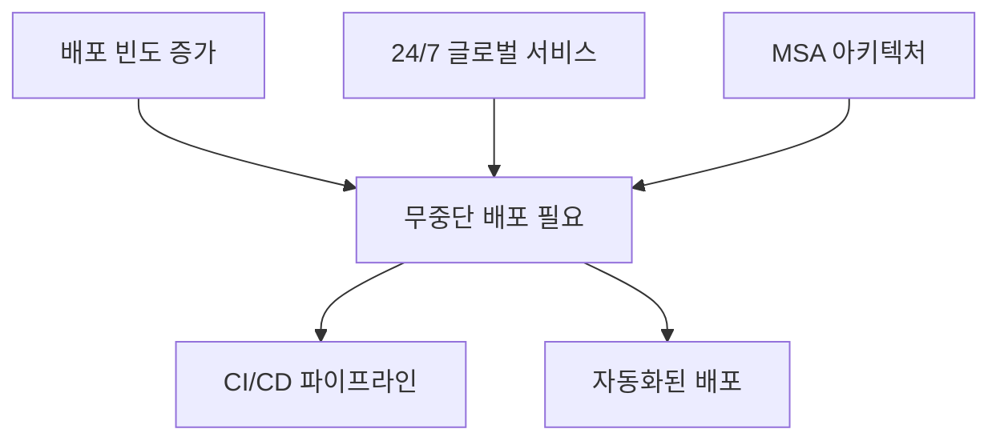
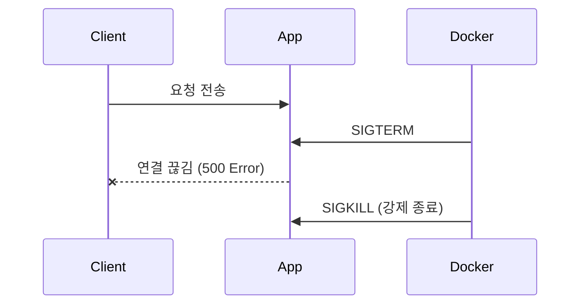
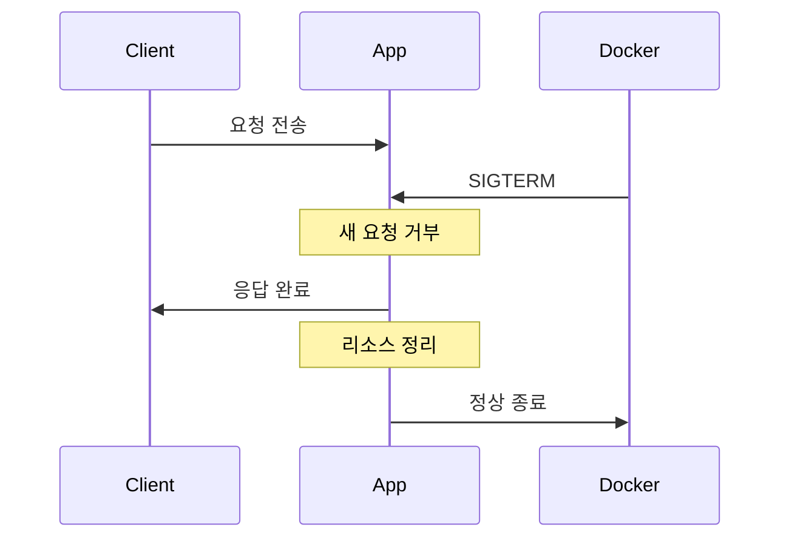

# 01. 무중단 배포 기본 개념

## 무중단 배포란?

**무중단 배포(Zero-Downtime Deployment)**는 서비스를 중단하지 않고 새로운 버전을 배포하는 기술입니다.

```
기존 방식:  v1 실행중 → [중단] → v2 실행
무중단:     v1 실행중 → v1+v2 동시 → v2 실행
                         ↑
                    서비스 중단 없음
```

---

## 왜 필요한가?

### 1. 비즈니스 관점

| 문제 | 영향 |
|------|------|
| 서비스 중단 | 매출 손실 (1분당 수백만원) |
| 사용자 이탈 | 경쟁사로 이동 |
| 신뢰도 하락 | 브랜드 가치 하락 |
| SLA 위반 | 계약 위약금 |

**실제 사례**:
- Amazon: 1초 지연 = 연간 $16억 매출 손실
- Google: 500ms 지연 = 검색량 20% 감소

### 2. 기술적 관점



- **DevOps 문화**: 하루 수십 회 배포
- **글로벌 서비스**: 점검 시간대가 없음
- **마이크로서비스**: 독립적 배포 필수

---

## 해결해야 할 문제들

### 1. 서비스 중단 (Downtime)

```
[기존 방식]
t=0s:  v1 실행 중 (요청 처리 중)
t=1s:  docker stop v1  ← 요청 실패 시작
t=5s:  docker run v2
t=15s: v2 시작 완료    ← 요청 처리 재개

       → 14초간 서비스 중단
```

### 2. 세션 유실

```
사용자 A: 로그인 → 장바구니 담기 → [배포] → 장바구니 초기화됨!
```

- 메모리 기반 세션은 컨테이너 종료 시 사라짐
- 해결책: Redis 세션 스토어, JWT 토큰

### 3. 연결 끊김

- WebSocket 연결 강제 종료
- Long Polling 요청 실패
- 실시간 알림 누락

### 4. 롤백 어려움

```
[버그 발견 시]
1. 문제 인지 (5분)
2. 이전 버전 이미지 찾기 (3분)
3. 재배포 (10분)

→ 총 18분간 장애 지속
```

---

## Graceful Shutdown vs Hard Shutdown

### Hard Shutdown (현재 방식)

```bash
docker stop container  # SIGTERM 후 10초 대기, SIGKILL
```



**문제점**:
- 처리 중인 요청 강제 종료
- 트랜잭션 미완료
- 데이터 불일치 가능

### Graceful Shutdown (목표)

```yaml
# application.yml
server:
  shutdown: graceful
spring:
  lifecycle:
    timeout-per-shutdown-phase: 30s
```



**단계**:
1. **SIGTERM 수신**: 종료 시그널 감지
2. **새 요청 거부**: 로드밸런서에서 제외
3. **처리 중 요청 완료**: 진행 중인 작업 마무리
4. **리소스 정리**: DB 연결, 파일 핸들 정리
5. **정상 종료**: 깔끔하게 프로세스 종료

---

## 핵심 용어 정리

| 용어 | 설명 |
|------|------|
| **Downtime** | 서비스 중단 시간 |
| **Rolling Update** | 인스턴스를 하나씩 교체하는 방식 |
| **Blue-Green** | 두 환경을 전환하는 방식 |
| **Canary** | 일부 트래픽만 새 버전으로 보내는 방식 |
| **Health Check** | 애플리케이션 정상 동작 확인 |
| **Load Balancer** | 트래픽을 분산하는 장치 |
| **Graceful Shutdown** | 정상적인 종료 절차 |

---

## 다음 단계

[02-deployment-strategies.md](./02-deployment-strategies.md)에서 각 배포 전략을 상세히 비교합니다.
