# 02. 배포 전략 비교

## 개요

무중단 배포를 구현하는 대표적인 전략 4가지를 비교합니다.

| 전략 | 핵심 개념 | 복잡도 |
|------|----------|--------|
| Rolling Update | 하나씩 교체 | 낮음 |
| Blue-Green | 환경 전환 | 중간 |
| Canary | 점진적 트래픽 | 높음 |
| A/B Testing | 사용자 분기 | 높음 |

---

## 1. Rolling Update (롤링 업데이트)

### 개념

인스턴스를 **하나씩 순차적으로** 교체하는 방식입니다.

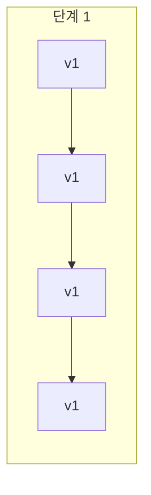

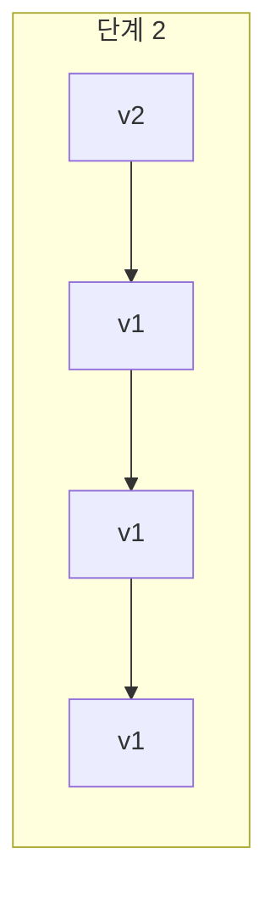

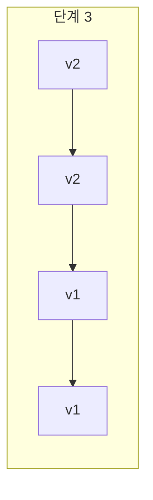

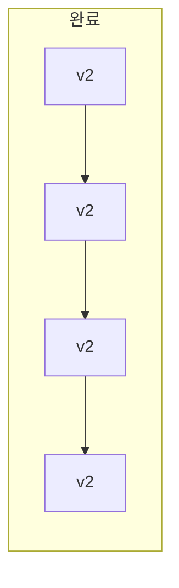

### 동작 방식

```
1. 인스턴스 1개를 로드밸런서에서 제외
2. 해당 인스턴스에 새 버전 배포
3. 헬스체크 통과 후 로드밸런서에 복귀
4. 다음 인스턴스에 대해 1~3 반복
```

### 장점

- **리소스 효율적**: 추가 인프라 불필요
- **점진적 배포**: 문제 발생 시 조기 발견
- **Kubernetes 기본 전략**: 설정이 간단

### 단점

- **버전 혼재**: 배포 중 v1, v2가 동시 존재
- **롤백 복잡**: 전체 롤백에 시간 소요
- **API 호환성 필수**: v1 ↔ v2 통신 가능해야 함

### 적합한 환경

- Kubernetes 클러스터
- 다수의 인스턴스 (4개 이상)
- API 하위 호환성 보장

### Kubernetes 예시

```yaml
apiVersion: apps/v1
kind: Deployment
spec:
  replicas: 4
  strategy:
    type: RollingUpdate
    rollingUpdate:
      maxSurge: 1        # 최대 추가 Pod 수
      maxUnavailable: 0  # 동시 중단 Pod 수
```

---

## 2. Blue-Green Deployment (블루-그린 배포)

### 개념

**동일한 두 환경**을 준비하고, 트래픽을 **한 번에 전환**하는 방식입니다.

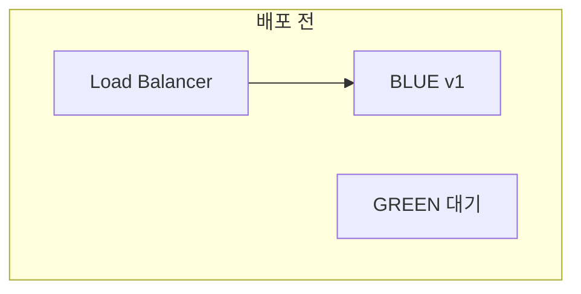

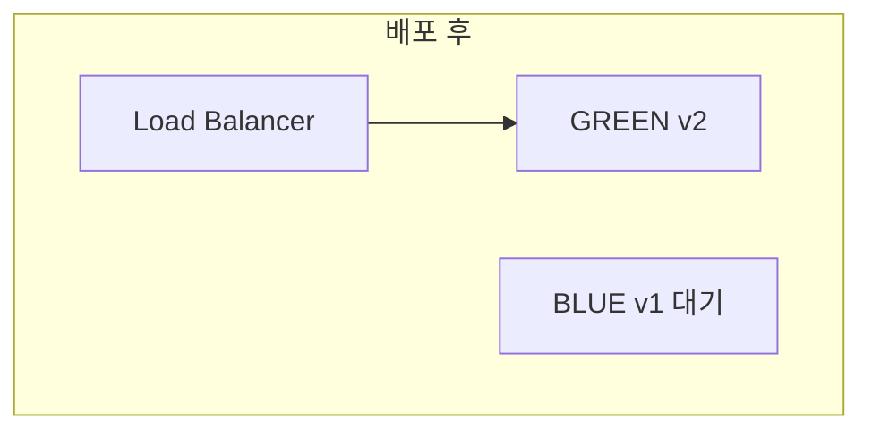

### 동작 방식

```
Phase 1: 초기 상태
┌────────────────────────────────────┐
│  LB ──────→ BLUE (v1) [Active]    │
│             GREEN (없음)           │
└────────────────────────────────────┘

Phase 2: 새 버전 배포
┌────────────────────────────────────┐
│  LB ──────→ BLUE (v1) [Active]    │
│             GREEN (v2) [대기]      │
└────────────────────────────────────┘

Phase 3: 트래픽 전환 (순간)
┌────────────────────────────────────┐
│  LB ──────→ GREEN (v2) [Active]   │
│             BLUE (v1) [롤백 대기]  │
└────────────────────────────────────┘
```

### 장점

- **즉시 롤백**: 트래픽 전환만으로 복구 (1초 이내)
- **버전 혼재 없음**: 한 시점에 하나의 버전만 서비스
- **테스트 가능**: 전환 전 새 버전 검증 가능
- **간단한 구조**: 이해하기 쉬움

### 단점

- **2배 리소스**: 두 환경 모두 운영
- **데이터 동기화**: DB 스키마 변경 시 주의
- **세션 처리**: Sticky Session 사용 시 전환 문제

### 적합한 환경

- 단일 또는 소수 인스턴스
- 빠른 롤백이 필수인 서비스
- 리소스 여유가 있는 환경

### 이 프로젝트에서 선택한 이유

```
✓ 단일 EC2 인스턴스 → Kubernetes 없음
✓ 이미 준비된 Nginx 설정 파일
✓ Docker Compose로 쉽게 구성 가능
✓ 즉시 롤백 요구사항
```

---

## 3. Canary Deployment (카나리아 배포)

### 개념

새 버전에 **소량의 트래픽만** 보내고, 점차 늘려가는 방식입니다.

> "카나리아" 이름 유래: 광산에서 유독가스 감지용으로 카나리아 새를 사용

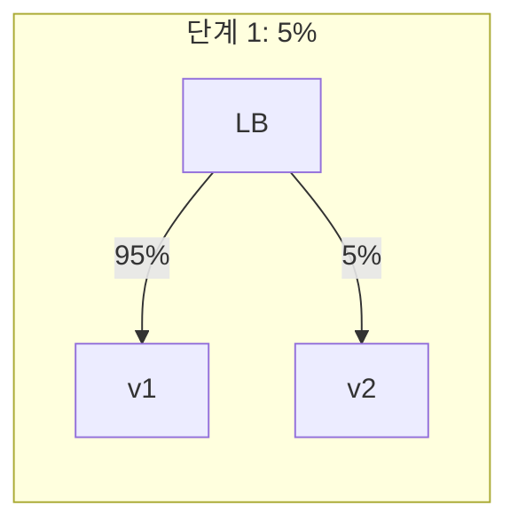

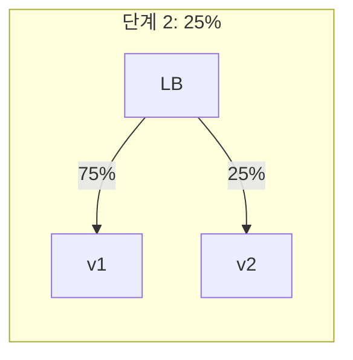

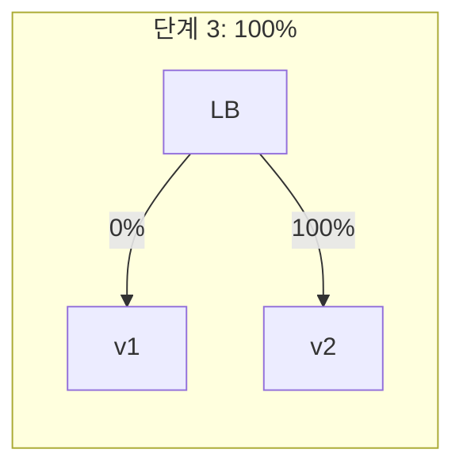

### 동작 방식

```
1. 새 버전 배포 (트래픽 0%)
2. 5% 트래픽을 새 버전으로 라우팅
3. 메트릭 모니터링 (에러율, 레이턴시)
4. 문제없으면 25% → 50% → 100% 점진적 확대
5. 문제 발생 시 즉시 0%로 롤백
```

### 장점

- **리스크 최소화**: 소수 사용자만 영향
- **실 트래픽 테스트**: 실제 환경에서 검증
- **데이터 기반 의사결정**: 메트릭으로 판단

### 단점

- **복잡한 라우팅**: 트래픽 분배 로직 필요
- **모니터링 필수**: 자동화된 메트릭 분석
- **긴 배포 시간**: 점진적 확대에 시간 소요

### 적합한 환경

- 대규모 트래픽 서비스
- 강력한 모니터링 시스템 보유
- 신중한 배포가 필요한 서비스

### Kubernetes + Istio 예시

```yaml
apiVersion: networking.istio.io/v1alpha3
kind: VirtualService
spec:
  http:
  - route:
    - destination:
        host: myapp
        subset: v1
      weight: 95
    - destination:
        host: myapp
        subset: v2
      weight: 5
```

---

## 4. A/B Testing

### 개념

**사용자 특성**에 따라 다른 버전을 보여주는 방식입니다.

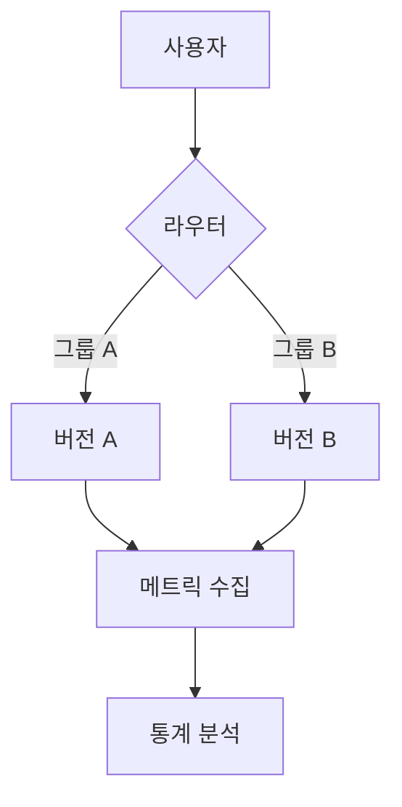

### Canary와의 차이점

| 구분 | Canary | A/B Testing |
|------|--------|-------------|
| 목적 | 기술적 안정성 검증 | 비즈니스 효과 검증 |
| 분배 기준 | 트래픽 비율 | 사용자 세그먼트 |
| 측정 지표 | 에러율, 레이턴시 | 전환율, 클릭률 |
| 담당 | DevOps/SRE | Product/Marketing |

### 적합한 환경

- UI/UX 변경 테스트
- 기능 효과 측정
- 마케팅 캠페인

---

## 전략 비교 요약

| 전략 | 롤백 속도 | 리소스 | 복잡도 | 버전 혼재 | 적합 환경 |
|------|----------|--------|--------|----------|----------|
| **Rolling** | 느림 | 1x | 낮음 | O | K8s, 다수 인스턴스 |
| **Blue-Green** | 즉시 | 2x | 중간 | X | 소수 인스턴스, 빠른 롤백 |
| **Canary** | 빠름 | 1.x | 높음 | O | 대규모 서비스 |
| **A/B** | 빠름 | 1.x | 높음 | O | 제품 실험 |

---

## 선택 가이드

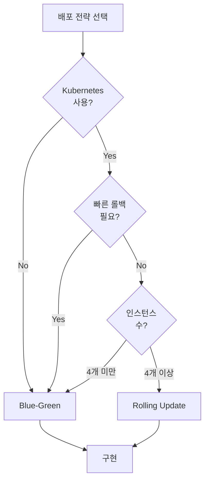

---

## 다음 단계

[03-blue-green-deep-dive.md](./03-blue-green-deep-dive.md)에서 Blue-Green 배포를 상세히 분석합니다.
