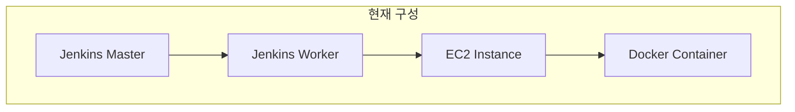
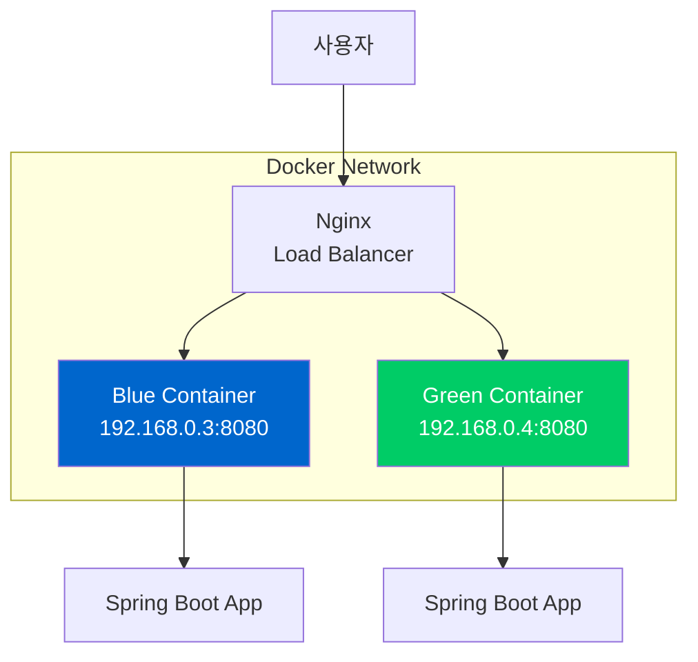
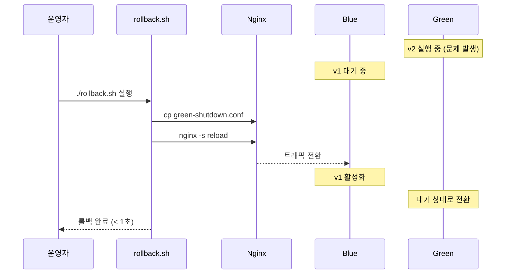
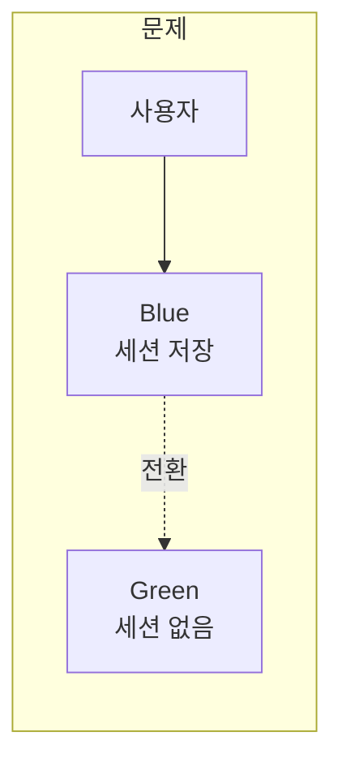

# 03. Blue-Green 배포 심층 분석

## 이 프로젝트에 Blue-Green이 적합한 이유

### 현재 인프라 분석



| 항목 | 현황 | Blue-Green 적합성 |
|------|------|------------------|
| 컨테이너 런타임 | Docker | O (Compose로 관리) |
| 오케스트레이션 | 없음 (단일 EC2) | O (K8s 불필요) |
| 로드밸런서 | Nginx | O (설정 파일 전환) |
| 리소스 | 여유 있음 | O (2x 감당 가능) |

### 이미 준비된 자원

```
nginx-conf/
├── all-up.conf          ✓ Blue + Green 동시 활성
├── blue-shutdown.conf   ✓ Green만 활성
└── green-shutdown.conf  ✓ Blue만 활성
```

---

## Blue-Green 아키텍처

### 전체 구조



### IP 할당

| 컴포넌트 | 호스트명 | IP 주소 | 포트 |
|----------|----------|---------|------|
| Nginx | api-gateway | 192.168.0.2 | 80 |
| Blue | app-blue | 192.168.0.3 | 8080 |
| Green | app-green | 192.168.0.4 | 8080 |

---

## 배포 흐름 상세

### Phase 1: 초기 상태 (Blue 활성)

```
┌─────────────────────────────────────────────────────┐
│                    사용자 요청                        │
│                        │                             │
│                        ▼                             │
│              ┌─────────────────┐                    │
│              │     Nginx       │                    │
│              │  (api-gateway)  │                    │
│              └────────┬────────┘                    │
│                       │                             │
│         upstream: app-blue:8080                     │
│                       │                             │
│                       ▼                             │
│  ┌─────────────────┐     ┌─────────────────┐       │
│  │      BLUE       │     │     GREEN       │       │
│  │  192.168.0.3    │     │  192.168.0.4    │       │
│  │   v1 (Active)   │     │    (없음)       │       │
│  └─────────────────┘     └─────────────────┘       │
└─────────────────────────────────────────────────────┘

nginx-conf/fastcampus-cicd.conf:
upstream app-blue {
    server app-blue:8080;
}
```

### Phase 2: Green에 새 버전 배포

```
┌─────────────────────────────────────────────────────┐
│  1. docker pull beomiya/cicd-study:${BUILD_NUMBER}  │
│  2. docker-compose up -d app-green                  │
│                                                     │
│                       Nginx                         │
│                        │                            │
│         upstream: app-blue:8080 (변경 없음)         │
│                        │                            │
│                        ▼                            │
│  ┌─────────────────┐     ┌─────────────────┐       │
│  │      BLUE       │     │     GREEN       │       │
│  │   v1 (Active)   │     │   v2 (Ready)    │       │
│  │  트래픽 처리 중  │     │   헬스체크 대기  │       │
│  └─────────────────┘     └─────────────────┘       │
└─────────────────────────────────────────────────────┘
```

### Phase 3: 헬스체크

```bash
# 헬스체크 스크립트
HEALTH_URL="http://192.168.0.4:8080/health"
MAX_RETRIES=10
RETRY_INTERVAL=5

for i in $(seq 1 $MAX_RETRIES); do
    response=$(curl -s -o /dev/null -w "%{http_code}" $HEALTH_URL)

    if [ "$response" = "200" ]; then
        echo "Health check passed!"
        exit 0
    fi

    echo "Attempt $i/$MAX_RETRIES: HTTP $response"
    sleep $RETRY_INTERVAL
done

echo "Health check failed!"
exit 1
```

**체크 항목**:
- HTTP 200 응답 확인
- 최대 10회 재시도 (5초 간격 = 최대 50초)
- 실패 시 배포 중단

### Phase 4: 트래픽 전환

```
┌─────────────────────────────────────────────────────┐
│  1. cp blue-shutdown.conf fastcampus-cicd.conf      │
│  2. nginx -s reload                                 │
│                                                     │
│                       Nginx                         │
│                        │                            │
│         upstream: app-green:8080 (전환됨!)          │
│                        │                            │
│                        ▼                            │
│  ┌─────────────────┐     ┌─────────────────┐       │
│  │      BLUE       │     │     GREEN       │       │
│  │   v1 (Standby)  │     │   v2 (Active)   │       │
│  │  롤백 대기 중    │     │  트래픽 처리 중  │       │
│  └─────────────────┘     └─────────────────┘       │
└─────────────────────────────────────────────────────┘

nginx-conf/fastcampus-cicd.conf (변경 후):
upstream app-blue {
    server app-green:8080;  # Green으로 전환
}
```

**트래픽 전환 시간**: nginx reload는 **1초 미만**

### Phase 5: 완료 상태

```
┌─────────────────────────────────────────────────────┐
│  배포 완료!                                          │
│                                                     │
│  Active:  GREEN (v2) - 모든 트래픽 처리             │
│  Standby: BLUE (v1) - 롤백 대기                     │
│                                                     │
│  다음 배포 시:                                       │
│  - BLUE에 v3 배포                                   │
│  - 트래픽을 BLUE로 전환                             │
│  - GREEN은 롤백 대기                                │
└─────────────────────────────────────────────────────┘
```

---

## 롤백 시나리오

### 즉시 롤백 (1초 이내)



### 롤백 명령

```bash
#!/bin/bash
# rollback.sh

# 현재 활성 환경 확인
ACTIVE=$(grep -oP 'server app-\K(blue|green)' /etc/nginx/conf.d/fastcampus-cicd.conf | head -1)

# 반대 환경으로 전환
if [ "$ACTIVE" = "blue" ]; then
    cp /etc/nginx/conf.d/blue-shutdown.conf /etc/nginx/conf.d/fastcampus-cicd.conf
    echo "Switched to GREEN"
else
    cp /etc/nginx/conf.d/green-shutdown.conf /etc/nginx/conf.d/fastcampus-cicd.conf
    echo "Switched to BLUE"
fi

nginx -s reload
echo "Rollback completed!"
```

---

## Nginx 설정 파일 분석

### green-shutdown.conf (Blue만 활성)

```nginx
upstream app-blue {
    server app-blue:8080;
}
```

### blue-shutdown.conf (Green만 활성)

```nginx
upstream app-blue {
    server app-green:8080;
}
```

### all-up.conf (둘 다 활성)

```nginx
upstream app-blue {
    server app-blue:8080;
    server app-green:8080;
}
```

> **주의**: upstream 이름이 `app-blue`로 고정되어 있어 nginx.conf의 `proxy_pass http://app-blue`와 호환됩니다.

---

## 고려사항

### 1. 데이터베이스 스키마 변경

```
문제 상황:
v1: users 테이블에 email 컬럼
v2: users 테이블에 email 컬럼 삭제, contact_email 추가

→ 롤백 시 v1이 email 컬럼을 찾지 못함
```

**해결책**:
1. **Expand-Contract 패턴**
   - v2: 새 컬럼 추가 (기존 유지)
   - v3: 기존 컬럼 제거

2. **하위 호환성 유지**
   - 컬럼 삭제는 2~3번 배포 후 진행

### 2. 세션 관리



**해결책**:
- Redis 세션 스토어 사용
- JWT 토큰 기반 인증

### 3. 롱 러닝 작업

```
문제: 배치 작업이 30분 동안 실행 중인데 배포 발생
→ 작업 강제 종료 가능
```

**해결책**:
- Graceful Shutdown 타임아웃 설정
- 작업 완료 대기 로직 추가

---

## 성능 영향

| 항목 | 영향 |
|------|------|
| 배포 중 서비스 | 영향 없음 (Blue 계속 처리) |
| 트래픽 전환 | 1초 미만 |
| 메모리 사용 | 일시적 2배 (두 컨테이너) |
| 롤백 시간 | 1초 미만 |

---

## 다음 단계

[04-implementation-guide.md](./04-implementation-guide.md)에서 실제 구현 방법을 다룹니다.
