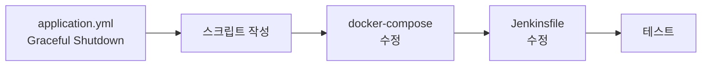
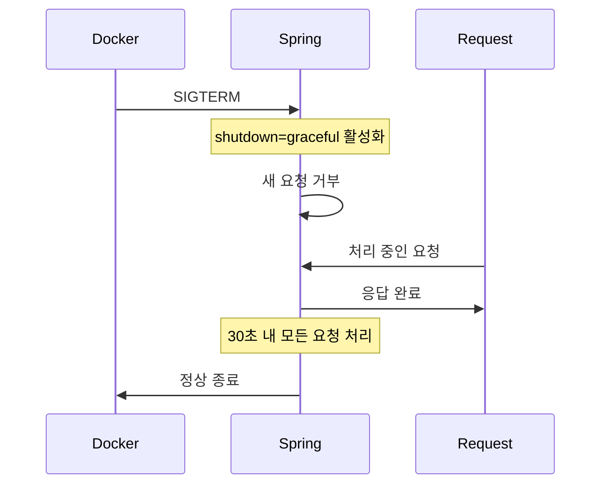

# 04. Blue-Green 배포 구현 가이드

## 구현 개요

이 가이드는 현재 프로젝트에 Blue-Green 무중단 배포를 적용하는 단계별 방법을 설명합니다.



---

## Step 1: Graceful Shutdown 설정

### 목적
컨테이너 종료 시 처리 중인 요청을 안전하게 완료합니다.

### 수정 파일: `src/main/resources/application.yml`

```yaml
spring:
  application:
    name: cicd-study

  autoconfigure:
    exclude: org.springframework.boot.autoconfigure.jdbc.DataSourceAutoConfiguration

  # Graceful Shutdown 설정 추가
  lifecycle:
    timeout-per-shutdown-phase: 30s

# Graceful Shutdown 활성화
server:
  shutdown: graceful
```

### 동작 방식



---

## Step 2: 배포 스크립트 작성

### 디렉토리 구조

```
scripts/
├── deploy-blue-green.sh   # 메인 배포 스크립트
├── health-check.sh        # 헬스체크
├── rollback.sh            # 롤백
└── switch-traffic.sh      # 트래픽 전환
```

### deploy-blue-green.sh

```bash
#!/bin/bash
#
# Blue-Green 무중단 배포 스크립트
#
# 사용법: ./deploy-blue-green.sh <docker_image>
# 예시:   ./deploy-blue-green.sh beomiya/cicd-study:42

set -e

# ===== 설정 =====
IMAGE_TAG="${1:-beomiya/cicd-study:latest}"
COMPOSE_FILE="/home/ubuntu/docker-compose-app.yml"
NGINX_CONF_DIR="/home/ubuntu/nginx-conf"
ACTIVE_CONF="${NGINX_CONF_DIR}/fastcampus-cicd.conf"

MAX_HEALTH_RETRIES=10
HEALTH_RETRY_INTERVAL=5

# ===== 함수 정의 =====

# 현재 활성 환경 감지
get_active_env() {
    if grep -q "app-green" "$ACTIVE_CONF" 2>/dev/null; then
        echo "green"
    else
        echo "blue"
    fi
}

# 헬스체크
health_check() {
    local target_env=$1
    local health_url="http://app-${target_env}:8080/health"

    echo "Starting health check for $target_env..."

    for i in $(seq 1 $MAX_HEALTH_RETRIES); do
        if docker exec api-gateway curl -sf "$health_url" > /dev/null 2>&1; then
            echo "Health check passed! ($target_env)"
            return 0
        fi
        echo "Attempt $i/$MAX_HEALTH_RETRIES failed. Waiting ${HEALTH_RETRY_INTERVAL}s..."
        sleep $HEALTH_RETRY_INTERVAL
    done

    echo "Health check FAILED for $target_env"
    return 1
}

# 트래픽 전환
switch_traffic() {
    local target_env=$1
    local conf_file=""

    case $target_env in
        "blue")
            conf_file="green-shutdown.conf"
            ;;
        "green")
            conf_file="blue-shutdown.conf"
            ;;
        "both")
            conf_file="all-up.conf"
            ;;
        *)
            echo "Unknown target: $target_env"
            return 1
            ;;
    esac

    echo "Switching traffic to: $target_env"
    cp "${NGINX_CONF_DIR}/${conf_file}" "$ACTIVE_CONF"
    docker exec api-gateway nginx -s reload
    echo "Traffic switched successfully!"
}

# ===== 메인 로직 =====

main() {
    echo "============================================"
    echo "  Blue-Green Deployment"
    echo "  Image: $IMAGE_TAG"
    echo "============================================"

    # 1. 현재 상태 확인
    local active_env=$(get_active_env)
    local deploy_env=""

    if [ "$active_env" = "blue" ]; then
        deploy_env="green"
    else
        deploy_env="blue"
    fi

    echo ""
    echo "[Step 1] Current Status"
    echo "  Active:  $active_env"
    echo "  Deploy:  $deploy_env"

    # 2. 새 이미지 Pull
    echo ""
    echo "[Step 2] Pulling new image..."
    docker pull "$IMAGE_TAG"

    # 3. 대기 환경에 배포
    echo ""
    echo "[Step 3] Deploying to $deploy_env..."
    export IMAGE="$IMAGE_TAG"
    docker-compose -f "$COMPOSE_FILE" up -d "app-${deploy_env}"

    # 4. 헬스체크
    echo ""
    echo "[Step 4] Running health check..."
    if ! health_check "$deploy_env"; then
        echo ""
        echo "ERROR: Health check failed!"
        echo "Rolling back deployment..."
        docker-compose -f "$COMPOSE_FILE" stop "app-${deploy_env}"
        exit 1
    fi

    # 5. 트래픽 전환
    echo ""
    echo "[Step 5] Switching traffic..."
    switch_traffic "$deploy_env"

    # 6. 완료
    echo ""
    echo "============================================"
    echo "  Deployment Completed Successfully!"
    echo ""
    echo "  Active:  $deploy_env (new)"
    echo "  Standby: $active_env (rollback ready)"
    echo "============================================"
}

main
```

### health-check.sh

```bash
#!/bin/bash
#
# 헬스체크 스크립트
#
# 사용법: ./health-check.sh <blue|green>

set -e

TARGET_ENV="${1:-blue}"
MAX_RETRIES="${2:-10}"
RETRY_INTERVAL="${3:-5}"

HEALTH_URL="http://app-${TARGET_ENV}:8080/health"

echo "Health checking: $HEALTH_URL"

for i in $(seq 1 $MAX_RETRIES); do
    response=$(docker exec api-gateway curl -s -o /dev/null -w "%{http_code}" "$HEALTH_URL" 2>/dev/null || echo "000")

    if [ "$response" = "200" ]; then
        echo "SUCCESS: Health check passed (HTTP 200)"
        exit 0
    fi

    echo "Attempt $i/$MAX_RETRIES: HTTP $response"
    sleep $RETRY_INTERVAL
done

echo "FAILED: Health check failed after $MAX_RETRIES attempts"
exit 1
```

### rollback.sh

```bash
#!/bin/bash
#
# 즉시 롤백 스크립트
#
# 사용법: ./rollback.sh

set -e

NGINX_CONF_DIR="/home/ubuntu/nginx-conf"
ACTIVE_CONF="${NGINX_CONF_DIR}/fastcampus-cicd.conf"

# 현재 활성 환경 확인
if grep -q "app-green" "$ACTIVE_CONF" 2>/dev/null; then
    ACTIVE="green"
    ROLLBACK="blue"
    CONF_FILE="green-shutdown.conf"
else
    ACTIVE="blue"
    ROLLBACK="green"
    CONF_FILE="blue-shutdown.conf"
fi

echo "============================================"
echo "  Rollback"
echo "============================================"
echo "  Current Active: $ACTIVE"
echo "  Rollback to:    $ROLLBACK"
echo ""

# 트래픽 전환
cp "${NGINX_CONF_DIR}/${CONF_FILE}" "$ACTIVE_CONF"
docker exec api-gateway nginx -s reload

echo "============================================"
echo "  Rollback Completed!"
echo "  Active: $ROLLBACK"
echo "============================================"
```

### switch-traffic.sh

```bash
#!/bin/bash
#
# 트래픽 전환 스크립트
#
# 사용법: ./switch-traffic.sh <blue|green|both>

set -e

TARGET="${1:-blue}"
NGINX_CONF_DIR="/home/ubuntu/nginx-conf"
ACTIVE_CONF="${NGINX_CONF_DIR}/fastcampus-cicd.conf"

case $TARGET in
    "blue")
        CONF_FILE="green-shutdown.conf"
        ;;
    "green")
        CONF_FILE="blue-shutdown.conf"
        ;;
    "both")
        CONF_FILE="all-up.conf"
        ;;
    *)
        echo "Usage: $0 <blue|green|both>"
        exit 1
        ;;
esac

echo "Switching traffic to: $TARGET"
cp "${NGINX_CONF_DIR}/${CONF_FILE}" "$ACTIVE_CONF"
docker exec api-gateway nginx -s reload
echo "Done! Active: $TARGET"
```

---

## Step 3: docker-compose-app.yml 수정

### 수정 내용

1. `IMAGE` 환경변수로 이미지 태그 동적 지정
2. `healthcheck` 설정 추가
3. `container_name` 고정

```yaml
version: "3"

networks:
  vpc:
    driver: bridge
    ipam:
      driver: default
      config:
        - subnet: 192.168.0.0/24
          gateway: 192.168.0.1

services:
  app-blue:
    hostname: app-blue
    container_name: app-blue
    image: ${IMAGE:-beomiya/cicd-study:latest}
    ports:
      - "8081:8080"
    volumes:
      - ./src/main/resources/application-blue.yml:/application.yml
    environment:
      SPRING_PROFILES_ACTIVE: dev
    networks:
      vpc:
        ipv4_address: 192.168.0.3
    healthcheck:
      test: ["CMD", "curl", "-f", "http://localhost:8080/health"]
      interval: 10s
      timeout: 5s
      retries: 3
      start_period: 30s

  app-green:
    hostname: app-green
    container_name: app-green
    image: ${IMAGE:-beomiya/cicd-study:latest}
    ports:
      - "8082:8080"
    volumes:
      - ./src/main/resources/application-green.yml:/application.yml
    environment:
      SPRING_PROFILES_ACTIVE: dev
    networks:
      vpc:
        ipv4_address: 192.168.0.4
    healthcheck:
      test: ["CMD", "curl", "-f", "http://localhost:8080/health"]
      interval: 10s
      timeout: 5s
      retries: 3
      start_period: 30s

  api-gateway:
    image: nginx
    hostname: api-gateway
    container_name: api-gateway
    ports:
      - "80:80"
    volumes:
      - ./nginx.conf:/etc/nginx/nginx.conf
      - ./nginx-conf:/etc/nginx/conf.d
    networks:
      vpc:
        ipv4_address: 192.168.0.2
    depends_on:
      - app-blue
      - app-green
```

---

## Step 4: Jenkinsfile 수정

### 변경 전 (다운타임 발생)

```groovy
stage('Deploy to EC2') {
    steps {
        sh '''
            docker stop $(docker ps -q --filter publish=8080) || true
            docker rm $(docker ps -aq --filter publish=8080) || true
            docker run -d --name app -p 8080:8080 ${DOCKER_IMAGE}:latest
        '''
    }
}
```

### 변경 후 (무중단 배포)

```groovy
pipeline {
    agent none

    environment {
        DOCKER_IMAGE = 'beomiya/cicd-study'
        DOCKER_TAG = "${BUILD_NUMBER}"
        EC2_HOST = "ec2-43-200-4-51.ap-northeast-2.compute.amazonaws.com"
        DEPLOY_PATH = "/home/ubuntu"
    }

    stages {
        stage('Checkout') {
            agent { label 'built-in' }
            steps {
                checkout scm
            }
        }

        stage('Build & Test') {
            agent { label 'built-in' }
            steps {
                sh './gradlew clean build -x npmInstall -x npmBuild -x copyFrontend'
            }
        }

        stage('Docker Build & Push') {
            agent { label 'built-in' }
            steps {
                script {
                    docker.withRegistry('https://registry.hub.docker.com', 'dockerhub-credentials') {
                        def image = docker.build("${DOCKER_IMAGE}:${DOCKER_TAG}", "--platform linux/amd64 .")
                        image.push()
                        image.push('latest')
                    }
                }
            }
        }

        stage('Detect Active Environment') {
            agent { label 'deploy' }
            steps {
                sshagent(['ec2-ssh-key']) {
                    script {
                        env.ACTIVE_ENV = sh(
                            script: """
                                ssh -o StrictHostKeyChecking=no ubuntu@${EC2_HOST} '
                                    if grep -q "app-green" ${DEPLOY_PATH}/nginx-conf/fastcampus-cicd.conf 2>/dev/null; then
                                        echo "green"
                                    else
                                        echo "blue"
                                    fi
                                '
                            """,
                            returnStdout: true
                        ).trim()

                        env.DEPLOY_ENV = (env.ACTIVE_ENV == 'blue') ? 'green' : 'blue'
                        echo "Current Active: ${env.ACTIVE_ENV}"
                        echo "Deploying to: ${env.DEPLOY_ENV}"
                    }
                }
            }
        }

        stage('Deploy to Standby') {
            agent { label 'deploy' }
            steps {
                sshagent(['ec2-ssh-key']) {
                    sh """
                        ssh -o StrictHostKeyChecking=no ubuntu@${EC2_HOST} '
                            docker pull ${DOCKER_IMAGE}:${DOCKER_TAG}
                            cd ${DEPLOY_PATH}
                            export IMAGE=${DOCKER_IMAGE}:${DOCKER_TAG}
                            docker-compose -f docker-compose-app.yml up -d app-${env.DEPLOY_ENV}
                        '
                    """
                }
            }
        }

        stage('Health Check') {
            agent { label 'deploy' }
            steps {
                sshagent(['ec2-ssh-key']) {
                    sh """
                        ssh -o StrictHostKeyChecking=no ubuntu@${EC2_HOST} '
                            MAX_RETRIES=10
                            RETRY_INTERVAL=5
                            HEALTH_URL="http://app-${env.DEPLOY_ENV}:8080/health"

                            for i in \$(seq 1 \$MAX_RETRIES); do
                                if docker exec api-gateway curl -sf "\$HEALTH_URL" > /dev/null 2>&1; then
                                    echo "Health check passed!"
                                    exit 0
                                fi
                                echo "Attempt \$i/\$MAX_RETRIES failed..."
                                sleep \$RETRY_INTERVAL
                            done

                            echo "Health check FAILED!"
                            exit 1
                        '
                    """
                }
            }
        }

        stage('Switch Traffic') {
            agent { label 'deploy' }
            steps {
                sshagent(['ec2-ssh-key']) {
                    sh """
                        ssh -o StrictHostKeyChecking=no ubuntu@${EC2_HOST} '
                            NGINX_CONF_DIR="${DEPLOY_PATH}/nginx-conf"

                            if [ "${env.DEPLOY_ENV}" = "green" ]; then
                                cp "\${NGINX_CONF_DIR}/blue-shutdown.conf" "\${NGINX_CONF_DIR}/fastcampus-cicd.conf"
                            else
                                cp "\${NGINX_CONF_DIR}/green-shutdown.conf" "\${NGINX_CONF_DIR}/fastcampus-cicd.conf"
                            fi

                            docker exec api-gateway nginx -s reload
                            echo "Traffic switched to ${env.DEPLOY_ENV}!"
                        '
                    """
                }
            }
        }
    }

    post {
        success {
            echo "Blue-Green deployment successful!"
            echo "Active: ${env.DEPLOY_ENV}"
            echo "Standby: ${env.ACTIVE_ENV} (ready for rollback)"
        }
        failure {
            echo "Deployment failed! Keeping current environment active."
            script {
                if (env.ACTIVE_ENV != null) {
                    echo "Current active environment (${env.ACTIVE_ENV}) is still serving traffic."
                }
            }
        }
    }
}
```

---

## Step 5: EC2 환경 준비

### 필요한 파일 배포

```bash
# EC2에 SSH 접속 후
cd /home/ubuntu

# 디렉토리 구조 확인
ls -la
# docker-compose-app.yml
# nginx.conf
# nginx-conf/
#   ├── all-up.conf
#   ├── blue-shutdown.conf
#   ├── green-shutdown.conf
#   └── fastcampus-cicd.conf  # 초기: green-shutdown.conf 복사

# 스크립트 배포
mkdir -p scripts
# deploy-blue-green.sh, health-check.sh, rollback.sh, switch-traffic.sh 복사
chmod +x scripts/*.sh

# 초기 설정 (Blue 활성)
cp nginx-conf/green-shutdown.conf nginx-conf/fastcampus-cicd.conf

# Nginx + Blue 컨테이너 시작
docker-compose -f docker-compose-app.yml up -d api-gateway app-blue
```

---

## 검증 방법

### 1. 무중단 배포 테스트

```bash
# 터미널 1: 지속적 요청
while true; do
    curl -s -w "%{http_code}\n" -o /dev/null http://localhost/health
    sleep 0.5
done

# 터미널 2: Jenkins 빌드 트리거
# 모든 응답이 200이어야 함
```

### 2. 롤백 테스트

```bash
# 현재 상태 확인
curl http://localhost/health
# 응답: cicd-study-green (v2)

# 롤백 실행
./scripts/rollback.sh

# 1초 후 확인
curl http://localhost/health
# 응답: cicd-study-blue (v1)
```

### 3. 헬스체크 실패 테스트

```bash
# 의도적으로 잘못된 이미지로 배포
export IMAGE=beomiya/cicd-study:nonexistent
docker-compose -f docker-compose-app.yml up -d app-green

# 헬스체크 실패 확인
./scripts/health-check.sh green
# 출력: FAILED: Health check failed after 10 attempts

# 기존 서비스 정상 확인
curl http://localhost/health
# 응답: cicd-study-blue (v1 유지)
```

---

## 트러블슈팅

### 문제 1: Nginx reload 실패

```
nginx: [error] open() "/run/nginx.pid" failed
```

**해결**: Nginx 컨테이너 재시작
```bash
docker restart api-gateway
```

### 문제 2: 헬스체크 타임아웃

**원인**: Spring Boot 시작 시간이 50초 초과

**해결**: `MAX_HEALTH_RETRIES` 또는 `RETRY_INTERVAL` 증가
```bash
MAX_HEALTH_RETRIES=20
RETRY_INTERVAL=10
```

### 문제 3: 컨테이너 네트워크 연결 불가

```
curl: (7) Failed to connect to app-green port 8080
```

**해결**: 네트워크 확인
```bash
docker network ls
docker network inspect ci-cd-study_vpc
```

---

## 요약

| 단계 | 파일 | 설명 |
|------|------|------|
| 1 | `application.yml` | Graceful Shutdown 설정 |
| 2 | `scripts/*.sh` | 배포/롤백/헬스체크 스크립트 |
| 3 | `docker-compose-app.yml` | healthcheck, IMAGE 환경변수 |
| 4 | `Jenkinsfile` | Blue-Green 배포 파이프라인 |
| 5 | EC2 환경 | 초기 설정 및 파일 배포 |
