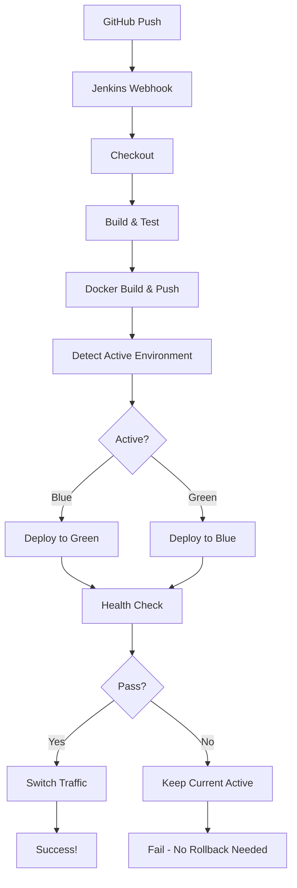

# 05. EC2 초기 설정 및 검증 가이드

## EC2 환경 준비

### 1. 필요한 파일 EC2에 업로드

```bash
# 로컬에서 EC2로 파일 전송
scp -i your-key.pem docker-compose-app.yml ubuntu@EC2_HOST:/home/ubuntu/
scp -i your-key.pem nginx.conf ubuntu@EC2_HOST:/home/ubuntu/
scp -r -i your-key.pem nginx-conf ubuntu@EC2_HOST:/home/ubuntu/
scp -r -i your-key.pem scripts ubuntu@EC2_HOST:/home/ubuntu/
scp -r -i your-key.pem src/main/resources/application-*.yml ubuntu@EC2_HOST:/home/ubuntu/src/main/resources/
```

### 2. EC2에서 초기 설정

```bash
# EC2 SSH 접속
ssh -i your-key.pem ubuntu@EC2_HOST

# 디렉토리 구조 확인
cd /home/ubuntu
ls -la

# 예상 구조:
# /home/ubuntu/
# ├── docker-compose-app.yml
# ├── nginx.conf
# ├── nginx-conf/
# │   ├── all-up.conf
# │   ├── blue-shutdown.conf
# │   └── green-shutdown.conf
# ├── scripts/
# │   ├── deploy-blue-green.sh
# │   ├── health-check.sh
# │   ├── rollback.sh
# │   └── switch-traffic.sh
# └── src/main/resources/
#     ├── application-blue.yml
#     └── application-green.yml
```

### 3. 초기 Nginx 설정 생성

```bash
# Blue를 기본 활성 환경으로 설정
cp nginx-conf/green-shutdown.conf nginx-conf/fastcampus-cicd.conf
```

### 4. 스크립트 실행 권한 부여

```bash
chmod +x scripts/*.sh
```

### 5. Docker 네트워크 및 컨테이너 시작

```bash
# Nginx + Blue 컨테이너 시작
docker-compose -f docker-compose-app.yml up -d api-gateway app-blue

# 상태 확인
docker ps

# 예상 출력:
# CONTAINER ID   IMAGE                      STATUS          PORTS
# xxx            nginx                      Up 10 seconds   0.0.0.0:80->80/tcp
# xxx            beomiya/cicd-study:latest  Up 10 seconds   0.0.0.0:8081->8080/tcp
```

### 6. 초기 동작 확인

```bash
# 헬스체크 엔드포인트 확인
curl http://localhost/health

# 예상 응답:
# cicd-study-blue Health Status - OK (2024-xx-xx xx:xx:xx)
```

---

## 검증 테스트

### 테스트 1: 무중단 배포 검증

**목표**: 배포 중에도 서비스 중단 없이 요청 처리

**방법**:
```bash
# 터미널 1: 지속적 요청 전송
while true; do
    response=$(curl -s -w "%{http_code}" -o /dev/null http://localhost/health)
    timestamp=$(date '+%H:%M:%S')
    echo "[$timestamp] HTTP $response"
    sleep 0.5
done
```

```bash
# 터미널 2: Jenkins 빌드 트리거
# (또는 GitHub Push)
```

**예상 결과**:
```
[10:00:01] HTTP 200
[10:00:02] HTTP 200
[10:00:02] HTTP 200
... (배포 진행 중)
[10:01:30] HTTP 200
[10:01:31] HTTP 200
# 모든 응답이 200
```

---

### 테스트 2: 롤백 검증

**목표**: 문제 발생 시 1초 이내 이전 버전으로 복구

**방법**:
```bash
# 현재 상태 확인
curl http://localhost/health
# 응답: cicd-study-green Health Status...

# 롤백 실행
./scripts/rollback.sh -y

# 즉시 확인
curl http://localhost/health
# 응답: cicd-study-blue Health Status... (이전 버전)
```

**예상 결과**:
- 롤백 완료까지 1초 미만
- 이전 버전으로 즉시 복구

---

### 테스트 3: 헬스체크 실패 시나리오

**목표**: 헬스체크 실패 시 트래픽 전환 없이 기존 서비스 유지

**방법**:
```bash
# 의도적으로 존재하지 않는 이미지로 배포 시도
export IMAGE=beomiya/cicd-study:nonexistent
docker-compose -f docker-compose-app.yml up -d app-green

# 헬스체크 실행
./scripts/health-check.sh green
```

**예상 결과**:
```
Attempt 1/10: HTTP 000 - Waiting 5s...
Attempt 2/10: HTTP 000 - Waiting 5s...
...
FAILED: Health check failed!

# 기존 서비스 확인
curl http://localhost/health
# 응답: cicd-study-blue (기존 버전 유지)
```

---

### 테스트 4: 부하 테스트

**목표**: 배포 중 요청 처리 성능 확인

**방법**:
```bash
# Apache Bench 설치 (Ubuntu)
sudo apt-get install apache2-utils

# 배포 중 1000개 요청 전송
ab -n 1000 -c 10 http://localhost/health
```

**예상 결과**:
```
Requests per second:    xxx.xx [#/sec]
Failed requests:        0       # 실패 요청 0
```

---

## 트러블슈팅

### 문제 1: Nginx reload 실패

```
nginx: [error] open() "/run/nginx.pid" failed
```

**해결**:
```bash
docker restart api-gateway
```

---

### 문제 2: 컨테이너 네트워크 연결 불가

```
curl: (7) Failed to connect to app-green port 8080
```

**원인**: Docker 네트워크 구성 문제

**해결**:
```bash
# 네트워크 확인
docker network ls
docker network inspect ci-cd-study_vpc

# 네트워크 재생성
docker-compose -f docker-compose-app.yml down
docker-compose -f docker-compose-app.yml up -d
```

---

### 문제 3: 헬스체크 타임아웃

**원인**: Spring Boot 시작 시간이 50초 초과

**해결**: 스크립트의 재시도 횟수/간격 조정
```bash
# scripts/deploy-blue-green.sh 수정
MAX_HEALTH_RETRIES=20    # 10 → 20
HEALTH_RETRY_INTERVAL=10 # 5 → 10
```

---

### 문제 4: Permission Denied

```
Permission denied while trying to connect to Docker daemon socket
```

**해결**:
```bash
sudo usermod -aG docker ubuntu
# 재접속 필요
```

---

## Jenkins 파이프라인 확인사항

### 필수 Credentials

| ID | 용도 | 설정 방법 |
|-----|-----|----------|
| `dockerhub-credentials` | Docker Hub 로그인 | Jenkins > Credentials > Add |
| `ec2-ssh-key` | EC2 SSH 접속 | SSH Agent Plugin 설치 후 Private Key 등록 |

### Jenkins 플러그인

- SSH Agent Plugin
- Docker Pipeline Plugin
- Pipeline Plugin

### Worker 설정

`deploy` 라벨이 붙은 Jenkins Worker가 EC2에 SSH 접속 가능해야 함.

---

## 파이프라인 흐름 요약



---

## 요약

| 테스트 | 명령어 | 기대 결과 |
|--------|--------|----------|
| 무중단 배포 | Jenkins 빌드 + curl 모니터링 | 모든 응답 200 |
| 롤백 | `./scripts/rollback.sh -y` | 1초 이내 복구 |
| 헬스체크 실패 | 잘못된 이미지 배포 | 기존 서비스 유지 |
| 부하 테스트 | `ab -n 1000 -c 10` | Failed requests: 0 |
