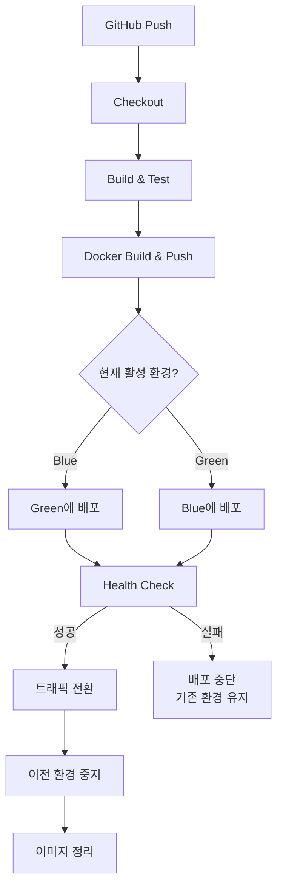

# 무중단 배포 (Zero-Downtime Deployment) 학습 가이드

## 개요

이 문서는 무중단 배포의 개념부터 실제 구현까지를 다루는 종합 학습 가이드입니다.
Jenkins CI/CD 파이프라인과 Blue-Green 배포 전략을 활용하여 실제 운영 환경에서의 무중단 배포를 구현합니다.

## 학습 목표

1. 무중단 배포가 **왜 필요한지** 이해한다
2. 다양한 배포 전략의 **장단점**을 비교할 수 있다
3. Blue-Green 배포를 **직접 구현**할 수 있다
4. 배포 실패 시 **즉시 롤백**할 수 있다
5. Jenkins CI/CD 파이프라인을 **구축하고 운영**할 수 있다
6. 발생하는 문제를 **스스로 해결**할 수 있다

## 문서 구조

| 순서 | 파일 | 내용 |
|------|------|------|
| 1 | [01-concepts.md](./01-concepts.md) | 무중단 배포 기본 개념 |
| 2 | [02-deployment-strategies.md](./02-deployment-strategies.md) | 배포 전략 비교 |
| 3 | [03-blue-green-deep-dive.md](./03-blue-green-deep-dive.md) | Blue-Green 상세 분석 |
| 4 | [04-implementation-guide.md](./04-implementation-guide.md) | 프로젝트 적용 가이드 |
| 5 | [05-ec2-setup-guide.md](./05-ec2-setup-guide.md) | EC2 초기 설정 및 검증 |
| 6 | [06-troubleshooting.md](./06-troubleshooting.md) | 트러블슈팅 가이드 |
| 7 | [07-jenkins-setup.md](./07-jenkins-setup.md) | Jenkins CI/CD 환경 구축 |

## 학습 순서


### 권장 학습 경로

1. **이론 학습** (01 → 02 → 03)
   - 무중단 배포가 왜 필요한지 이해
   - 다양한 배포 전략 비교
   - Blue-Green 방식 심층 분석

2. **환경 구축** (07 → 05)
   - Jenkins Master-Worker 구조 구축
   - EC2 운영 환경 준비

3. **구현 및 운영** (04 → 06)
   - Jenkinsfile 파이프라인 작성
   - 문제 발생 시 트러블슈팅

## 현재 프로젝트 상태

### Before (다운타임 발생)
```
배포 시작 → 기존 컨테이너 종료 → 새 컨테이너 시작 → 배포 완료
                    │                    │
                    └──── 10~30초 중단 ────┘
```

### After (무중단 - 현재 구현)
```
GitHub Push → Jenkins Build → Docker Push → EC2 배포 → 헬스체크 → 트래픽 전환
                                                                      │
                                                                중단 시간: 0초
```

### 파이프라인 플로우



## 관련 파일

| 파일 | 위치 | 설명 |
|------|------|------|
| `Jenkinsfile` | 프로젝트 루트 | Blue-Green 배포 파이프라인 |
| `docker-compose.yml` | 프로젝트 루트 | Jenkins 로컬 환경 |
| `docker-compose-app.yml` | 프로젝트 루트 | EC2 Blue-Green 컨테이너 |
| `Dockerfile.jenkins-agent` | 프로젝트 루트 | Jenkins Worker 이미지 |
| `nginx.conf` | 프로젝트 루트 | Nginx 기본 설정 |
| `nginx-conf/` | 프로젝트 루트 | 트래픽 전환 설정 |

### nginx-conf 디렉토리 구조

```
nginx-conf/
├── fastcampus-cicd.conf    # 현재 활성 설정
├── blue-shutdown.conf       # Green만 활성
├── green-shutdown.conf      # Blue만 활성
└── all-up.conf              # 둘 다 활성 (부하 분산)
```

## 주요 트러블슈팅 사례

| 문제 | 해결 | 문서 |
|------|------|------|
| SSH 호스트 키 불일치 | `ssh-keyscan`으로 재등록 | [06-troubleshooting.md](./06-troubleshooting.md#1-ssh-호스트-키-불일치) |
| Docker 권한 오류 | `usermod -aG root jenkins` | [06-troubleshooting.md](./06-troubleshooting.md#2-docker-권한-오류-jenkins-worker) |
| EC2 설정 파일 없음 | Sync Config Files 스테이지 추가 | [06-troubleshooting.md](./06-troubleshooting.md#4-ec2-설정-파일-없음) |
| 헬스체크 실패 | api-gateway 함께 시작 | [06-troubleshooting.md](./06-troubleshooting.md#5-api-gateway-컨테이너-없음) |
| fastcampus-cicd.conf 없음 | 초기 설정 파일 생성 | [06-troubleshooting.md](./06-troubleshooting.md#11-fastcampus-cicdconf-파일-없음) |
| 포트 80 사용 중 | 시스템 Nginx 중지 | [06-troubleshooting.md](./06-troubleshooting.md#12-시스템-nginx가-포트-80-점유) |
